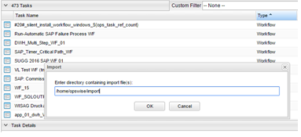

# ut-inf-pc-v9-6-startworkflow-win
# Abstract: 

This Universal Task allows to schedule an Informatica Power Center Workflow by calling the Power Center Webservices Hub SOAP command “startWorkflow”.

# 1.	Disclaimer

No support and no warranty are provided by Stonebranch GmbH for this document and the related Universal Task. The use of this document and the related Universal Task is on your own risk.

Before using this task in a production system, please perform extensive testing.

Stonebranch GmbH assumes no liability for damage caused by the performance of the Universal Tasks

# 2.	Introduction
Informatica Power Center provides a Web Services Hub to schedule Power Center Workflows using the SOAP communications protocol for web services. 
The here described Universal Task calls the * *“startWorkflow”* * SOAP Webservice to run a Workflow in Power Center.

Details on the Power Center Web Services Hub can be found here [1]:

Some details about the universal task for Power Center:
-	It is based on the standard Power Center (PC) Web Services Hub using SOAP protocol
- The PC Web Services Hub Interface is called from a Universal Agent running on a Server or Windows Server – Note: This document focuses on the Windows Version 
- The Windows Server needs to have Python 2.7.x or 3.6.x installed
-	Any Additional Web Services Hub SOAP command as listed in [1] can also be implemented using the same approach. 
-	An extract of the Python script, which is called as part of the Universal template can be found here [3] or can be looked up in the controller under the Universal template
-	Exit code processing has been added to the universal task script: 
       - In case a workflow fails E.g. If you provide a wrong workflow name, it will fail, and you can re-start the job with the correct ID. 
       - In case of a connection error the task will fail e.g. wrong IP address or Port of the Power Center Web services HOST
       - In case a wrong password has been entered the instance will fail
-	You can configure all connection Parameters via the Universal Task
-	You can select different log-levels e.g. Info and debug
-	Http and Https connections are support (Note: the host certificate is not verified)

# 3.	Installation
# 3.1	Software Requirements
**Universal Task name:** Informatica startWorkflow_Windows

**Related UAC XML Files for template and task: [2]**

**Software used:** 

For the set-up you need:
1.	Python 3.6.3 (or 2.7.x) for Windows installed on a server where a Universal Agent is installed. 
2.	For Python the following modules are required: 
    -	requests, to perform the REST connection towards the PC SOAP API
    -	argparse, to allow testing of the Universal Template script on the command line
    -	sys, for output re-direct processing
    -	datetime, date and time stamps for messages
    -	logging, to provide logging capabilities for debug, info etc.
    -	xml.dom.minidom import parse, parseString, to parse XML results

Note: Only the module requests need to be added to python 3.6.3

3.	Universal Controller 6.4.2.x or higher
4.	Universal Agent 6.3.0.3 or higher installed on a Windows Server
5.	Power Center 9.6.x with Web Service Hub enabled

# 3.2	Installation Steps
The following describes the installation steps:
**1.	Install Python 3.6.3 for Windows on the Universal Controller server or any Windows Server running a Universal Agent.** 

   Official Download link: https://www.python.org/downloads/ 
   
   Note:
   
   Install python with the options: 
   
   -	add python to windows path
   -	Install for all users

**2.	Add the request module to your python installation**

   In a dos command shell run as Administrator:
      
   *pip install requests*
      
   Note: The module requests contain the commands to perform the SOAP commands towards the Power Center Webservice Hub. 
   
   It is assumed that the modules argparse, sys, datetime, logging, xml.dom.minidom are already available. If not install them via      pip.

**3.	Import the Universal Task including the Universal Template to your Controller**

   Go to “All Tasks” and load via the Import functionality the Universal Task configuration into the Controller. 
   
   Image 1
   
   
   
   Image 2
   
   
   
# 4.	Universal Task Configuration
**1.	Activate: Resolvable Credentials in Universal Automation Center:**

Image 3

**2.	Fill Out the Universal Task for each Power Center Workflow to be scheduled:**

Image 4

**Power Center Credential for Universal Task:**

Image5

**Description:**

Image 6

# 5. Power Centre

The following provides to non-Informatica Consultants an Introduction how to verify that a Workflow, which was started via the Universal Task for Power Center, has been successfully executed in PC.

**5.1	How to lookup a Workflow instance in PC**
**1.	Log-in to the Power Center Workflow Monitor**

Image 7

**2.	Log-in to the Power Center Workflow Monitor**

Browse to your Workflowname. In the example the Workflow is called: Load_Seller_Data
In the right screen you can see all executed instances including their status e.g. Succeeded.

Image 8

**3.	Verify the Workflow Log**

Right Click on the workflow will allow to Get the Workflow Log

Image 9

Note: The same Workflow log information is also available in the Universal Task Output.

**4.	Verify the Workflow Log in Universal Automation Center**

All Log Information show in the Power Center Workflow Monitor are also available in the Universal Controller Web-Gui in the Task Instance screen and Output. 

The following screenshot shows the Task Instance Screen:

Image 10

The following screenshot shows the Log file in the Task Instance Output Screen:

Image 11

# 6	Test Cases

The following basic test cases has been performed

Image 12

# 7	Document References

This document references the following documents:

Image13

